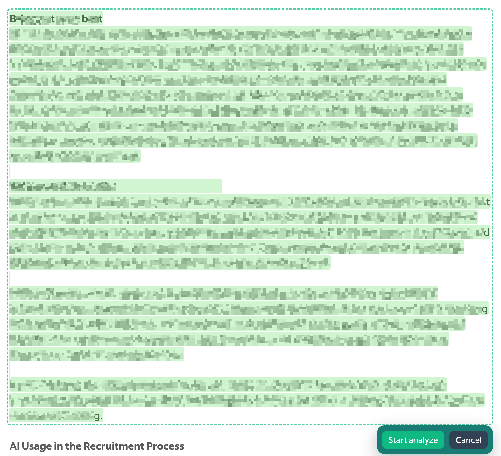

# JDA Extension

JDA (Job Description Analyzer) is a browser extension that helps you:
- compare job descriptions with your CV,
- quickly find matches and gaps,
- get a clean, structured report.

Everything runs locally in your browser. Your CV is not sent to the cloud. API keys are never exported unless you explicitly allow it in the Export dialog.

---

## 🔧 Installation

1) Download the latest release from [GitHub](https://github.com/AndreyKolygin/smja-extension/releases).
2) Unzip to any folder.
3) In Chrome/Chromium:
   - Open `chrome://extensions/`
   - Enable Developer mode
   - Click “Load unpacked” and select the extension folder
4) The extension icon appears in the toolbar.

Compatible with Chrome, Brave, Edge.

---

## ⚙️ First‑Run Defaults

Open Options. On first launch the extension is preconfigured with sensible defaults:

- Providers:
  - Ollama Local (`http://localhost:11434`)
  - Google Gemini (`https://generativelanguage.googleapis.com/v1beta`)
  - OpenAI (`https://api.openai.com/v1`)
- Models:
  - `Llama 3 (Ollama)` — active by default (local, no API key needed)
  - `Gemini 2.5 Flash lite` — active (requires Gemini API key)
  - `GPT‑4o mini` — inactive (enable if you have OpenAI access)
- Site rules (enabled): LinkedIn, hh.ru, Indeed
- Global templates: system prompt and Markdown output template

Recommended first steps:
- Paste your CV into General → CV
- If needed, add API keys for Gemini / OpenAI
- Tune System Prompt / Output Template to your style

Changes are autosaved; you can also press Save.

---

## 🛠 Options Overview

### Providers
- Add providers with name, Base URL, API key
- Edit and delete providers
- Helpful hints for popular services

### Models
- List of models (display name + ID)
- Each model is linked to a provider
- Optional per‑model system prompt override
- Enable/disable models for use
- Reorder via drag handle in the first column

### CV & Templates
- Paste and maintain your CV locally
- Global System Prompt that controls analysis style
- Output Template (Markdown skeleton)
- Autosave
- Clear prompt cache button

### Auto‑extraction Rules
- Manage job‑text extraction rules per site
- Support host patterns, wildcards, full‑URL masks, and regex
- Provide CSS selectors to extract job description blocks
- Enable/disable, edit, delete rules

### General (Language + Import/Export)
- Language: choose UI language (applies to popup and settings)
- Import / Export:
  - Export Settings → modal to pick groups:
    - Provider Settings (separate checkbox “Include API keys”)
    - Models
    - Auto‑extraction Rules
    - CV
    - System Prompt Template
    - Result Output Template
  - Import Settings → Merge/Replace modes and group selection
  - Reset to defaults → restore preconfigured defaults (see below)

---

## 📊 How to Use

1) Open a job posting page
2) Select the job description
3) Click the extension icon → Analyze
4) The popup renders a report:
   - Match score
   - Requirements
   - Main responsibilities
   - Key qualifications
   - Gaps between CV and posting
   - Actionable suggestions

If a site rule exists, click Auto‑grab to automatically pull the description into the input.

---

## 💾 Import & Export

- Export: save selected groups to JSON. API keys are excluded by default; include them with the “Include API keys” checkbox.
- Import: load settings with modes:
  - Merge / add (updates by ID, preserves existing)
  - Replace selected groups  
  
  Empty API keys during merge will not overwrite existing keys.

## ♻️ Reset to Defaults

- Reset to defaults in the Import / Export block
- Confirmation modal includes “Keep API keys” (enabled by default) to retain your keys
- Clears temporary caches of prompts/results

## 🔑 Supported Providers

- Google Gemini  
- OpenAI  
- Ollama (local)  
- Hugging Face  
- Anthropic  
- Perplexity  
- OpenRouter  
- Azure OpenAI  
- Meta / xAI  
- DeepSeek  

---

## 🖼 Screenshots

### Analyze

### Select job description

### LLM Settings

### Auto‑extraction Rules

### General Settings

---

## ❓ FAQ

**Q: Is my CV stored in the cloud?**  
A: No, all data is stored locally in your browser.

**Q: Can I use multiple providers?**  
A: Yes. Add several and switch models freely.

**Q: Are site rules case‑sensitive?**  
A: No, host and path matching is case‑insensitive.

**Q: Are API keys exported?**  
A: Only if you check “Include API keys” in the Export dialog. By default, keys are not exported.

## 📎 Links

- [Project on GitHub](https://github.com/AndreyKolygin/smja-extension)

- [Issues](https://github.com/AndreyKolygin/smja-extension/issues)

- [Readme (rus)](https://github.com/AndreyKolygin/smja-extension/blob/main/README.ru.md)

- [Changelog](https://github.com/AndreyKolygin/smja-extension/blob/main/CHANGELOG.md)
