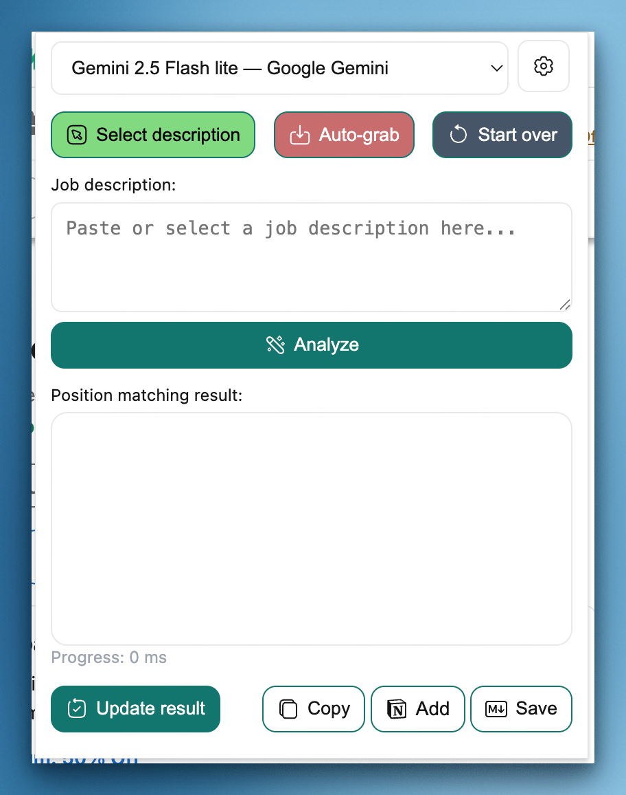
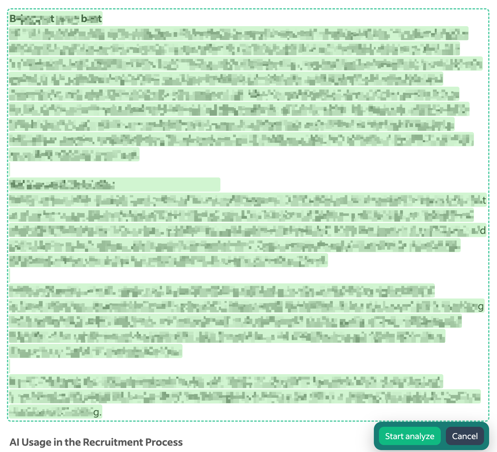
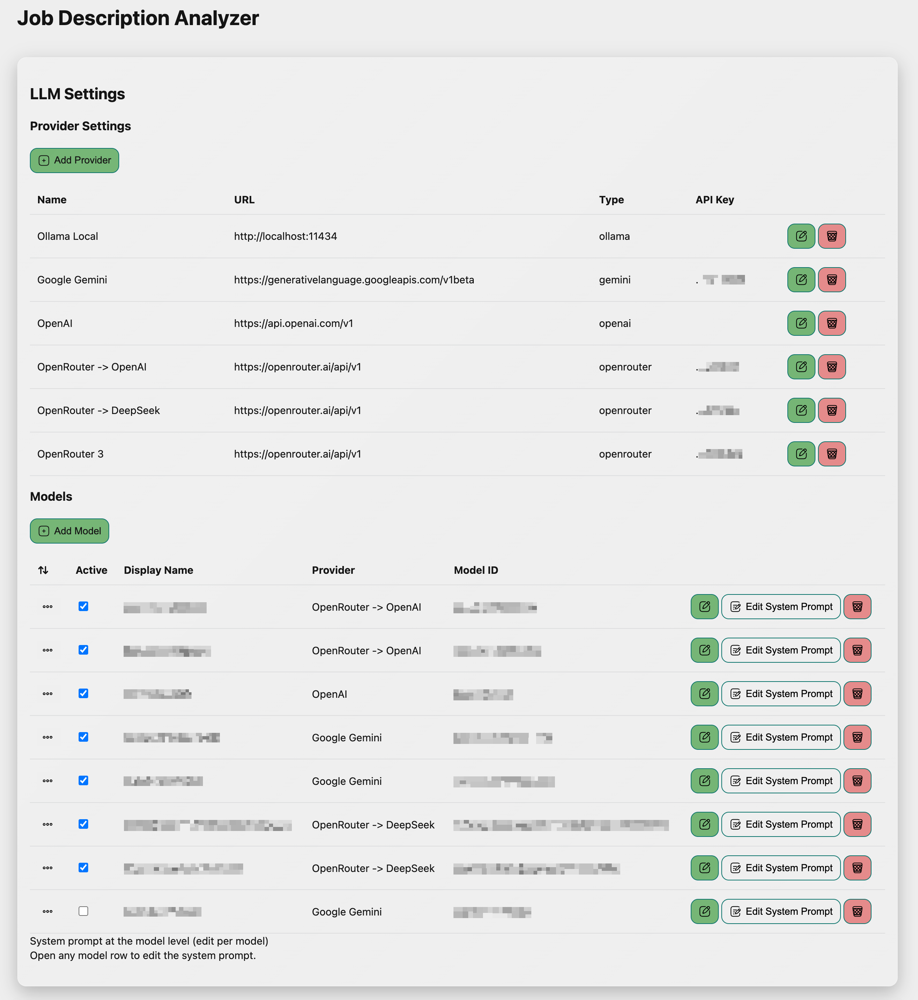
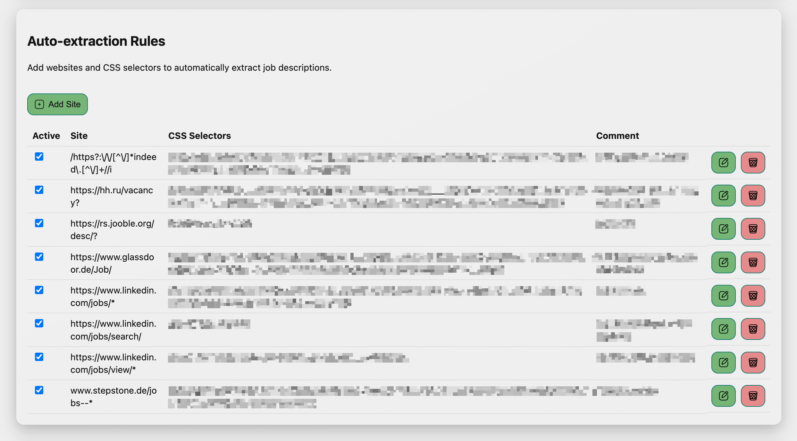
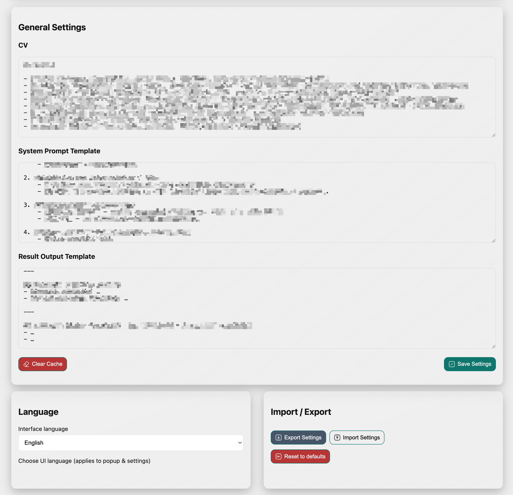

# JDA Extension

  

**JDA (Job Description Analyzer)** — это расширение для браузера, которое помогает:

- сравнивать описание вакансий с вашим резюме,

- быстро находить совпадения и пробелы,

- получать структурированный отчёт в удобном формате.

  

Работает локально в браузере. Данные резюме не отправляются в облако. Ключи API никогда не экспортируются, если вы явно не разрешите это при экспорте настроек.

  

---

  

## 🔧 Установка пошагово

  

1. Скачайте [последний релиз](https://github.com/AndreyKolygin/smja-extension/releases).

2. Распакуйте архив в любую папку.

3. В Chrome / Chromium:

- Откройте `chrome://extensions/`.

- Включите **Режим разработчика** (Developer mode).

- Нажмите **Load unpacked** и выберите папку расширения.

4. После этого иконка появится в панели браузера.

  

> 💡 Совместимо с Chrome, Brave, Edge.

  

---

  

## ⚙️ Первичная настройка (c дефолтами)

  

Откройте **Options** (настройки). С первого запуска расширение уже содержит готовый набор дефолтов:

  

- Провайдеры:

- `Ollama Local` (`http://localhost:11434`)

- `Google Gemini` (`https://generativelanguage.googleapis.com/v1beta`)

- `OpenAI` (`https://api.openai.com/v1`)

- Модели:

- `Llama 3 (Ollama)` — активна по умолчанию (локально, без ключей)

- `Gemini 2.5 Flash lite` — активна (нужен API‑ключ Gemini)

- `GPT‑4o mini` — неактивна (включите при наличии ключа OpenAI)

- Автоправила сайтов (включены): LinkedIn, hh.ru, Indeed

- Глобальные шаблоны: установлен системный промпт и шаблон Markdown вывода

  

Что стоит сделать сразу:

- Вставьте своё **CV** в раздел General → CV

- При необходимости укажите API‑ключи для Gemini / OpenAI

- При желании подправьте System Prompt / Output Template

  

Все изменения сохраняются автоматически (автосейв) и/или кнопкой Save.

  

---

  

## 🛠 Полная настройка Options

  

В разделе **Options** доступны следующие вкладки и блоки с подробной функциональностью:

  

### Провайдеры (Providers)

- **Добавление** новых провайдеров с указанием имени, базового URL и API-ключа.

- **Редактирование** существующих провайдеров, включая обновление API-ключей.

- **Удаление** провайдеров при необходимости.

- Настройка **Host Permissions** — указание разрешённых доменов, где провайдер может использоваться.

- Подсказки и рекомендации по заполнению API-ключей для популярных сервисов.

  

### Модели (Models)

- Отображение списка моделей с их **отображаемым именем** и уникальным **ID**.

- Привязка каждой модели к выбранному провайдеру.

- Возможность **переопределения системного промпта** для конкретной модели.

- Включение или отключение моделей для использования в анализе.

  

### Резюме и шаблоны (CV & Templates)

- Поле для вставки или редактирования собственного резюме (CV).

- Глобальный **System Prompt**, определяющий, как модель будет анализировать данные.

- Настройка **Output Template** — шаблона для итогового отчёта.

- Автоматическое сохранение всех изменений.

- Кнопка для **сброса кэша промптов**, чтобы обновить настройки при необходимости.

  

### Правила авто-выкачки (Auto-extract Rules)

- Управление правилами для автоматического извлечения описания вакансии с сайтов.

- Поддержка различных шаблонов сайтов: домены, подстановочные знаки (wildcard), регулярные выражения (regex).

- Настройка CSS-селекторов для точного выбора текста вакансии.

- Возможность **редактировать**, **удалять** и **включать/выключать** отдельные правила.

- **Примеры возможных шаблонов:**

- Домен: `linkedin.com`

- Подстановочные знаки (wildcard): `https://hh.ru/vacancy?`

- Регулярные выражения: `/^https:\/\/de\.indeed\.com\/jobs/`

- CSS-селекторы: `[data-at="header-job-title"]`, `div.jobsearch-JobComponent`

- Правила не чувствительны к регистру.

  

### Общие настройки (General)

- Импорт и экспорт настроек в JSON.

- Автосохранение при изменениях.

- Индикатор версии.

  

#### Language + Import/Export (новая раскладка)

- Блок **Language** (слева) — выбор языка интерфейса (применяется к попапу и настройкам)

- Блок **Import / Export** (справа):

- Export Settings → модалка выбора групп для экспорта:

- Provider Settings (отдельный чекбокс Include API keys для экспорта ключей)

- Models

- Auto-extraction Rules

- CV

- System Prompt Template

- Result Output Template

- Import Settings → модалка с режимами Merge/Replace и галочками групп

- Reset to defaults → восстановление стандартных значений (см. ниже)

  

---

  

## 📊 Как использовать

  

1. Откройте страницу вакансии.

2. Выделите описание должности.

3. Нажмите на иконку расширения → **Analyze**.

4. Всплывающее окно покажет отчёт:

- Оценка соответствия (1–100).

- Требования к языку.

- Основные задачи.

- Ключевые требования.

- Несоответствия между CV и вакансией.

- Рекомендации.

  

Если для сайта есть правило авто-выкачки, можно нажать **Auto-grab** для мгновенной подстановки описания вакансии в форму.

  

Вы можете скопировать результат или сохранить его в систему.

  

---

  

## 💾 Импорт и экспорт

  

- **Export** — сохраняет выбранные группы настроек в JSON. По умолчанию API‑ключи не включаются; их можно явно добавить галочкой “Include API keys”.

- **Import** — загрузка настроек из файла с режимами:

- Merge / add (обновляет по ID и сохраняет существующие)

- Replace выбранные группы

Можно импортировать как весь набор, так и отдельные группы. Пустые API‑ключи при мердже не затирают существующие.

  

## ♻️ Сброс к дефолтам

  

- Кнопка **Reset to defaults** в блоке Import / Export.

- При сбросе появляется модалка с опцией **Keep API keys** (включена по умолчанию) — позволяет оставить ваши ключи в дефолтном профиле.

- Временный кэш результатов и промптов очищается.

  

---

  

## 🗑 Управление

  

- **Провайдеры**: можно редактировать или удалять.

- **Модели**: можно включать/выключать, редактировать системный промпт, удалять.

- **Автосохранение** работает при любом изменении.

  

---

  

## 🔑 Поддерживаемые провайдеры

  

- Google Gemini

- OpenAI

- Ollama (локальные модели)

- Hugging Face

- Anthropic

- Perplexity

- OpenRouter

- Azure OpenAI

- Meta / xAI

- DeepSeek

  

---

  

## 🖼 Скриншоты

  

### Анализ вакансии

  

### Веление описания вакансии

  

### Настройки LLM

  

### Правила автоизвлечения

  

### Общие настройки

  

---

  

## ❓ FAQ

  

**В: Хранится ли CV в облаке?**

О: Нет, все данные сохраняются локально в браузере.

  

**В: Можно ли использовать несколько провайдеров?**

О: Да, можно добавить несколько и переключаться между моделями.

  

**В: Чувствительны ли правила авто-выкачки к регистру?**

О: Нет, домены и пути обрабатываются без учёта регистра.

  

**В: Экспортируются ли API‑ключи?**

О: Только если в модалке экспорта включить галочку “Include API keys”. По умолчанию ключи не экспортируются.

  

---

  

## 📎 Ссылки

  

- [GitHub проекта](https://github.com/AndreyKolygin/smja-extension)

- [Issues / багрепорты](https://github.com/AndreyKolygin/smja-extension/issues)

- [Changelog](CHANGELOG.md)